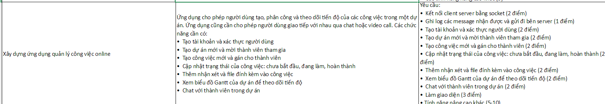

# Online Task Management Application

This application allows users to create, assign, and track the progress of tasks within a project. It also enables users to communicate with each other via chat or video call. The required features include:

## Features:

- User account creation and authentication
- Create new projects and invite members
- Create new tasks and assign them to members
- Update task status: not started, in progress, completed
- Add comments and attachments to tasks
- View Gantt chart of the project to track progress
- Chat with project members
- Video call with project members

## Requirements:

- Client-server connection using sockets (2 points)
- Log received and sent messages on the server (1 point)
- User account creation and authentication (2 points)
- Create new projects and invite members (2 points)
- Create new tasks and assign them to members (2 points)
- Update task status: not started, in progress, completed (2 points)
- Add comments and attachments to tasks (2 points)
- View Gantt chart of the project to track progress (2 points)
- Chat with project members (2 points)
- Create a user interface (3 points)
- Video call (2 points)

## Instructions to Run the Project

### Prerequisites

Make sure you have the following libraries installed on your system:

- SQLite
- GStreamer
- GTK

On Ubuntu, you can install these libraries using the following commands:

sudo apt-get install libsqlite3-dev
sudo apt-get install libgstreamer1.0-dev gstreamer1.0-plugins-base gstreamer1.0-plugins-good
sudo apt-get install libgtk-3-dev
